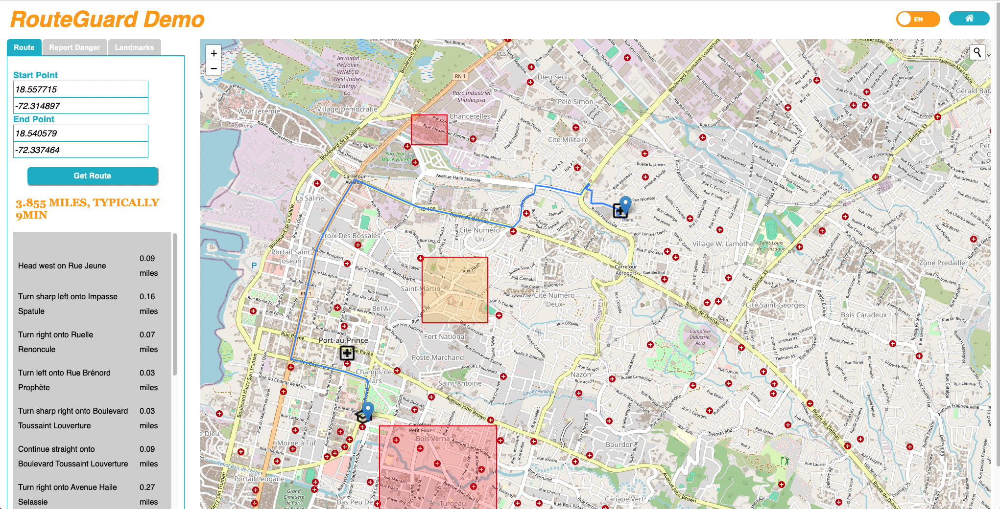
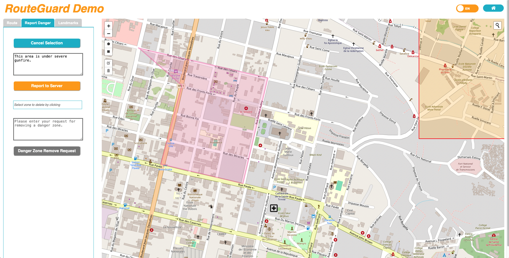
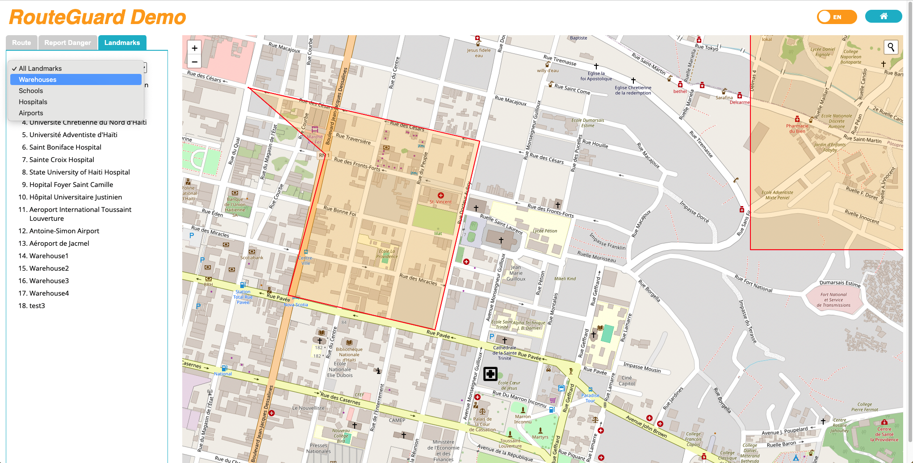
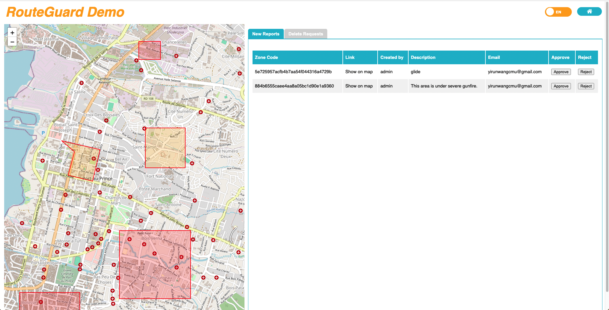

# RouteGuard: Web Application for Safe Route Planning in Hazardous Areas

## Overview

RouteGuard is a web application developed by Onipa LLC designed to provide reliable navigation and route planning services in dynamically changing and high-risk regions. By facilitating online route planning and hazard reporting, RouteGuard enhances safety and efficiency for organizations and individuals operating in hazardous areas.

## Purpose

The primary goal of RouteGuard is to offer a comprehensive solution for route planning where conditions can rapidly change due to various risks. By integrating real-time hazard reporting and enabling user contributions to safety measures, RouteGuard ensures access to the most current information for effective decision-making.

## Features

### User Functionalities

- **Route Planning Service**: Plan and navigate routes efficiently to various locations within the system.
- **Search Places on Map**: Utilize an interactive map interface to search for specific places or addresses.
- **Report New Danger Zones**: Contribute to community safety by reporting new danger zones.
- **Request Danger Zone Removal**: Submit requests to remove outdated or invalid danger zones to maintain accurate hazard information.
- **User Authentication**: Secure login and logout functionalities with registration and authentication support via [django-allauth](https://github.com/pennersr/django-allauth).
- **Google OAuth 2.0 Integration**: Sign up and log in using Google accounts for seamless access.

### Administrator Functionalities

- **Add or Remove Landmarks**: Manage the system's database by adding new landmarks or removing existing ones.
- **Approve or Decline Requests**: Review and process user-submitted requests related to danger zones.
- **User Management**: Modify user permissions, deactivate, or delete user accounts to maintain system integrity and security.

## Screenshots

- Search for places on the map:

  Click on the search icon located on the map interface. A search bar will appear upon clicking the icon.Enter the name of the desired place into the search bar.A list of matching places will be displayed.Click on the desired place from the list.The map will automatically zoom in to display the selected place in detail.

- Users can adjust the language settings from the default English to French using the switch button located at the top right corner of the interface.

- To set the start and end points for route planning, users have two options:

  Manually enter the latitude and longitude coordinates.

  Click on points directly on the map interface. Upon clicking, users can designate the selected point as the start or end point by clicking the corresponding button.

- To report a danger zone, users first navigate to the "Report Danger" tab.Next, they click on the "Select Danger Zone" button to activate the selection module on the map interface.Users then input a description of the danger zone and click the "Report to Server" button.

- As a result, other users will observe a newly added danger zone displayed in a non-approved color (yellow). Administrators will be able to view this new request on their danger zone management page.

Admin pages:

<video src="./assets/admin-video.mov"></video>

## System Architecture

RouteGuard is built using the Django web framework and follows a modular architecture for scalability and maintainability.

### Technology Stack

- **Backend**: [Django](https://www.djangoproject.com/) (Python), utilizing `django-allauth` for authentication.
- **Frontend**: Single-page application delivered to users' browsers for interactive map functionalities and route planning.
- **Web Server**: [Apache HTTP Server](https://httpd.apache.org/) handling static files and forwarding requests to Django via `mod_wsgi`.
- **Database**: Managed through Django's ORM for consistent and secure data handling.

### External Integrations

- **OpenStreetMap**: Provides the map service for location searches and map interactions.
- **OpenRouteService**: Powers the route planning functionalities within the application.
- **Email Service**: Implemented using `django-allauth`; requires SMTP server configuration for sending emails and password resets.
- **Google OAuth 2.0**: Enables authentication using Google accounts for user convenience.

### Deployment

The application is deployed on an Apache server, with static files served efficiently and dynamic requests handled by Django running under `mod_wsgi`. This containerized approach allows independent management and scaling of each system component.

## Future Enhancements

RouteGuard aims to integrate with additional systems like inventory management and customer relationship management (CRM) platforms to expand its capabilities and offer more comprehensive services to users.